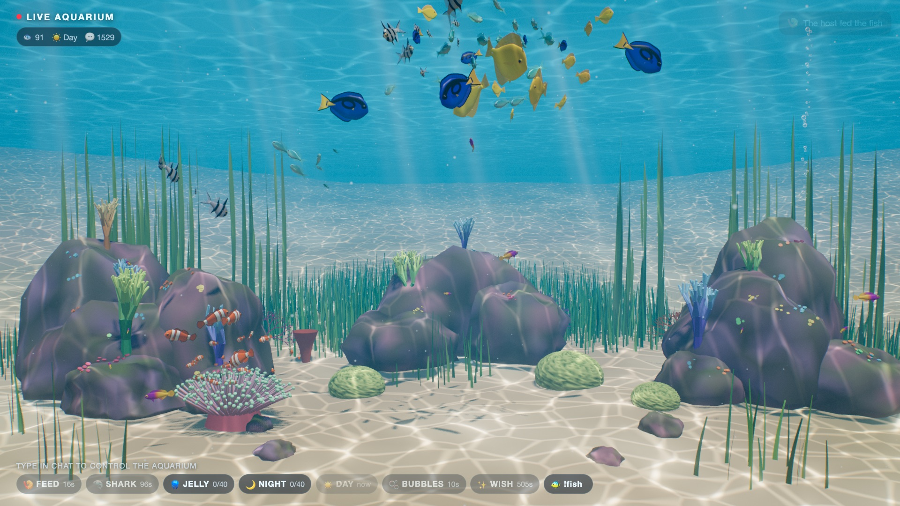
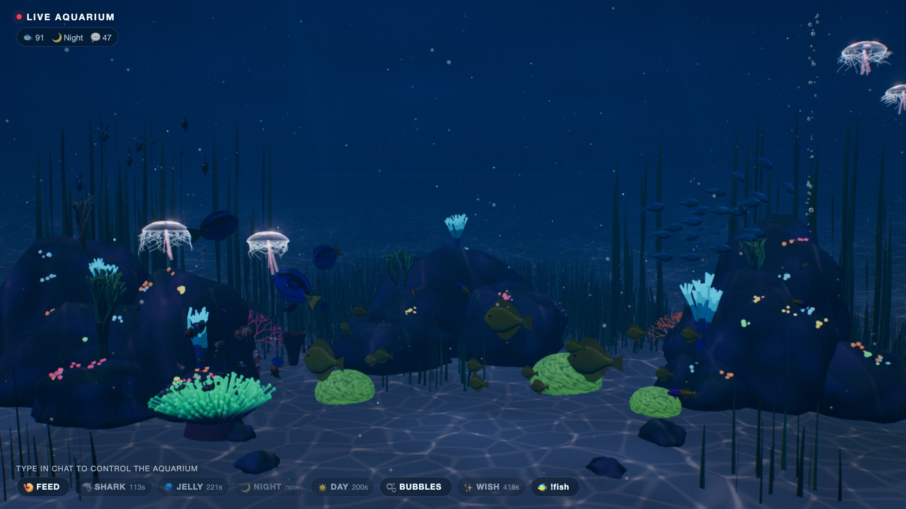
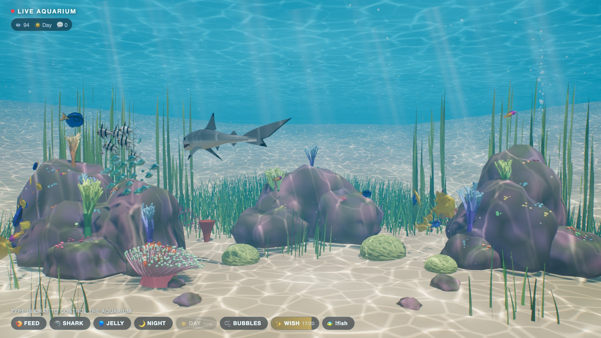
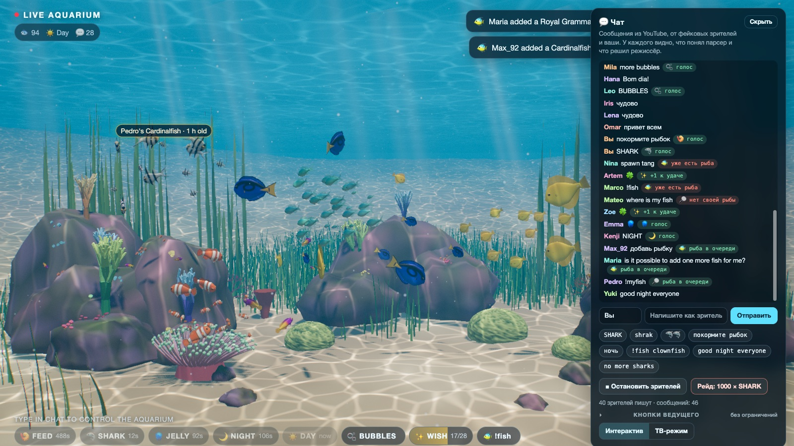
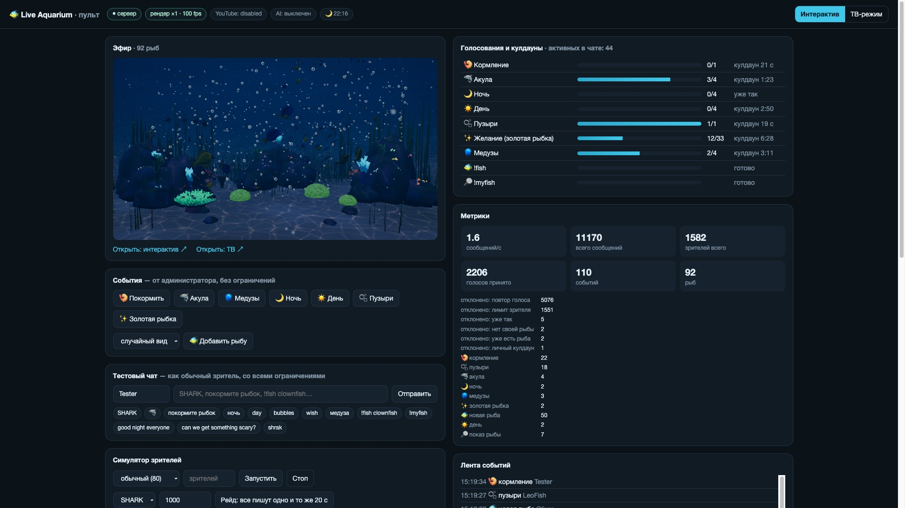

# Live Aquarium — прототип

Интерактивный виртуальный аквариум для YouTube-трансляций. Один живой мир работает в трёх форматах: спокойный ТВ/ASMR-эфир, интерактивный эфир, где зрители управляют аквариумом из чата, и заготовки для Shorts.



| Ночь: флуоресценция кораллов и медузы | Акула бросается на стаю |
|---|---|
|  |  |

## Что уже работает

- **3D-аквариум в браузере** (Three.js/WebGL). Шесть видов рифовых рыб, а также акула, золотая рыбка и медузы. Рыбы плавают стаями, всей стаей бросаются к корму, катаются на пузырях, прячутся от хищника, ночью опускаются ко дну и оставляют светящийся след в планктоне. Акула охотится: подкрадывается, раскрывает пасть и съедает одну рыбу. Есть смена дня и ночи с флуоресценцией кораллов, каустики на дне, лучи света, пузыри и процедурный ASMR-звук. Клоуны, золотая рыбка и акула — настоящие 3D-модели (бесплатные, CC BY, см. ниже). Остальные рыбы, риф и звук сгенерированы кодом.
- **«Режиссёр» событий.** Чат превращается в голоса, голоса в события. Сотня сообщений SHARK даёт одну акулу с подписью «summoned by 100 viewers». Есть антиспам, пороги, которые растут с аудиторией, кулдауны, приоритеты и общий лимит событий в минуту.
- **AI-парсер (Claude)** понимает свободные фразы вроде «рыбки голодные» или «can we get something scary?». Он только выбирает событие из белого списка: движком AI не управляет.
- **YouTube Live Chat.** Подключается по API-ключу или OAuth и расходует квоту экономно.
- **Симулятор зрителей и рейдов.** Можно проверить поведение без эфира, например «1500 человек пишут SHARK».
- **Мир живёт сам и сохраняется между перезапусками.** Смотритель кормит рыб, рождаются мальки, растут растения, изредка приходят гости. Рыбы зрителей остаются в аквариуме.
- **ТВ-режим**: без интерфейса, только спокойные события, статичные планы с медленными переходами камеры.
- **Пульт `/admin`**: статус, ручной запуск событий, тестовый чат, симулятор, YouTube, AI и модерация имён.
- **204 автотеста** сервера (`npm test`).

## Быстрый старт

Нужен Node.js 20.6 или новее.

```bash
npm install
```

```bash
npm start
```

| Адрес | Что это |
|---|---|
| http://localhost:8787/ | аквариум, интерактивный режим (с оверлеем команд) |
| http://localhost:8787/?mode=tv | аквариум, ТВ-режим (чистая картинка, медленная камера) |
| http://localhost:8787/admin | пульт управления |

Звук браузер включает только после клика по странице. В OBS звук работает сразу.

### Где чат

На странице аквариума справа есть панель **💬 Чат**. Туда приходят все сообщения: из YouTube (со значком ▶), от фейковых зрителей и ваши собственные. У каждого сообщения видно, что понял парсер и что решил режиссёр: «🦈 голос», «уже голосовал», «нет своей рыбы» и так далее. Там же можно:

- написать сообщение от имени зрителя (имя меняется в поле слева от ввода);
- запустить 40 фейковых зрителей или рейд «1000 × SHARK»;
- нажать кнопки ведущего, которые работают без ограничений;
- переключить режим «Интерактив / ТВ».

Надпись «TYPE IN CHAT…» внизу экрана обращена к зрителям YouTube: в эфире они пишут в обычный чат трансляции. Сама панель — инструмент для вас и в эфир не попадает. В OBS (Browser Source) её нет, в ТВ-режиме она свёрнута в кнопку «💬 Чат», а `?chat=0` скрывает её и в браузере. Тот же тестовый чат есть в пульте `/admin`.





Сразу после запуска чата нет, но аквариум живёт сам. Чтобы посмотреть на реакции зрителей, откройте пульт и нажмите «Симулятор → Запустить» или «Рейд».

### Горячие клавиши на странице аквариума

`F` кормление · `S` акула · `J` медузы · `N` ночь · `D` день · `B` пузыри · `G` золотая рыбка · `A` новая рыба · `C` стиль камеры · `O` оверлей · `H` отладочная панель (FPS и прочее)

### Параметры адреса

`mode=tv|interactive` · `q=low|med|high|ultra` (качество; `ultra` включает MSAA) · `camera=static|drift|cinematic` · `music=1` (генеративный эмбиент) · `vol=0..1` · `mute=1` · `debug=1` · `offline=1` (без сервера, локальный мир)

## Демо без установки

Приватная ссылка на демо: https://claude.ai/artifact/TVa2F71RdvsCTGochKSDuH (кнопка Share на странице открывает доступ партнёрам). В демо тот же аквариум и те же режиссёр, парсер и симулятор, только работают они прямо в браузере. Справа та же панель **💬 Чат**: можно запустить 40 фейковых зрителей, устроить рейд «1000 × SHARK» и написать самому. В узком окне панель свёрнута в кнопку «💬 Чат» в правом нижнем углу. YouTube и AI в демо не подключены.

Собрать демо заново после изменений:

```bash
node scripts/build-demo.mjs
```

Сборка появится в `dist/demo/`: копия рендера и модулей режиссёра, three.js подключается с CDN. Рядом, в `dist/site/`, лежит та же страница для обычного веб-сервера.

Прототип для показа выложен статикой на https://kd4.academy/aquarium/. Обновить его одной командой (соберёт демо и подменит папку на сервере целиком):

```bash
./scripts/deploy-site.sh
```

## 3D-модели рыб

| Вид | Модель | Что с ней сделано |
|---|---|---|
| Акула | большая белая «Great White Shark» (LasquetiSpice) | пасть с дёснами и зубами вылеплена в модели; челюсть открывается по весам её кости `Jaw`, верхняя губа при укусе приподнимается |
| Клоун | «Clownfish» (Bindestrek) | упрощена до 4 тыс. треугольников: их в анемоне целая стая |
| Золотая рыбка | «Ryukin goldfish» (somitsu) | полупрозрачные вуалевые плавники |

Авторы и ссылки — в [assets/models/CREDITS.md](assets/models/CREDITS.md). Лицензия CC BY 4.0 требует указать авторов, например в описании трансляции (строка для описания там же). Плавание и укус анимирует наш шейдер, скелеты моделей не используются. Если модель не загрузилась, вид остаётся процедурным; `?models=0` включает процедурных рыб, чтобы сравнить.

Как добавить модель:

1. Скачайте GLB в `assets/models/raw/`.
2. Опишите её в `MODELS` в [scripts/models/prepare.py](scripts/models/prepare.py): куда смотрит нос и спина, какие материалы — плавники, кость челюсти, лимит треугольников.
3. Запустите подготовку. Скрипт развернёт модель носом вперёд, приведёт к длине 1, разметит плавники и челюсть, уменьшит текстуры и сохранит GLB в `renderer/assets/models/`:

```bash
/Applications/Blender.app/Contents/MacOS/Blender -b -P scripts/models/prepare.py -- shark
```

4. Добавьте виду в [renderer/js/fish/species.js](renderer/js/fish/species.js) поле `model` с адресом файла. Для акулы там же `jawHinge` из вывода скрипта.

## Команды чата

Названия на экране английские: канал международный. Понимаются английский, русский, украинский, испанский и португальский, а также эмодзи и опечатки вроде `shrak` или `sharkkk`.

| Команда | Примеры | Что происходит | Правило |
|---|---|---|---|
| FEED | `feed`, `покормите рыбок`, `нагодуйте`, 🍤 | корм сыплется сверху, и весь аквариум 16 с рвётся к месту падения; рыбы-домоседы (клоуны у анемона, рыбы у камней) выплывают из укрытия лишь частично | 1 голос, кулдаун 25 с |
| SHARK | `shark`, `акула`, `АКУЛУ!`, 🦈 | акула патрулирует, подкрадывается и **съедает одну рыбу** (см. ниже); стаи сбиваются в плотный шар и прячутся, клоуны ныряют в анемон | 3 голоса + 4 % активных зрителей, кулдаун 3 мин |
| JELLY | `jellyfish`, `медуза`, 🪼 | светящиеся медузы; рыбы их обходят, кроме клоунов | 3 + 3 %, кулдаун 4 мин |
| NIGHT / DAY | `night`, `ночь`, `lights off`, 🌙 / `day`, `светло`, ☀️ | мир плавно перематывается к ночи или утру; ночью за быстрыми рыбами светится планктон, утром риф просыпается всплеском активности | 3 + 3 %, общий кулдаун 4 мин |
| BUBBLES | `bubbles`, `пузыри`, 🫧 | завеса пузырей; хромисы и тэнги катаются на ней вверх | 1 голос, кулдаун 30 с |
| WISH | `wish`, `золотая рыбка`, ✨ 🍀 | копилка удачи; когда она наполнена, приплывает золотая рыбка, хромисы и тэнги её сопровождают, а уходя, она оставляет малька | 20 + 30 % активных желаний |
| !fish | `!fish clownfish`, `хочу рыбку-клоуна`, `give me a nemo` | в аквариум заплывает рыба с именем зрителя, её встречают трое сородичей | одна рыба на зрителя |
| !myfish | `!myfish`, `где моя рыбка` | рыба подплывает к стеклу и позирует; в подписи её возраст и сколько акул она пережила | раз в 3 мин |

Порог никогда не больше числа активных зрителей: если в чате двое, двух голосов хватит. Голос модератора весит ×3, спонсора канала ×2, Super Chat ×10. Владелец канала считается администратором и проходит без ограничений.

Приветствия, упоминания и отрицания не голосуют: «good night everyone», «доброй ночи», «no more sharks», «не надо акулу».

### Кого ест акула

Жертву выбирает сервер в момент, когда приплывает акула. Поэтому все рендеры показывают одну и ту же рыбу, а мир сохраняется без расхождений. Правила задаются в `server/catalog.js`, в поле `shark.eat`:

- рыбок-клоунов акула не трогает (их защищает анемон), мальков младше суток тоже;
- если в аквариуме меньше 12 рыб, акула уплывает ни с чем;
- рыбы без хозяина попадаются втрое чаще, чем рыбы зрителей;
- если съели рыбу зрителя, на экране это написано, и зритель может сразу завести новую через `!fish`;
- остальные рыбы получают «+1 пережитая акула», это видно в `!myfish`.

Акула бросается через 10–18 с после появления. Момент укуса отмечается как хайлайт для Shorts с заголовком вроде «The Shark Ate Anna's Blue Tang».

## Как подключить YouTube

1. В [Google Cloud Console](https://console.cloud.google.com/) создайте проект, включите **YouTube Data API v3** и создайте API-ключ.
2. Скопируйте `.env.example` в `.env` и впишите `YOUTUBE_API_KEY`.
3. Запустите трансляцию и вставьте её ссылку в пульт («YouTube чат → Подключить»). Другой вариант — прописать `YOUTUBE_VIDEO_ID` в `.env`.

При подключении история чата пропускается, чтобы старые команды не сработали повторно. Если чтение чата по одному ключу не пройдёт, используйте OAuth (`YOUTUBE_CLIENT_ID`, `YOUTUBE_CLIENT_SECRET`, `YOUTUBE_REFRESH_TOKEN`). Тогда сервер сам находит активную трансляцию канала.

**Квота.** Один запрос чата стоит 1 единицу, по умолчанию доступно 10 000 единиц в сутки. Сервер распределяет остаток квоты на время до полуночи по тихоокеанскому времени, когда квота обнуляется. Круглосуточно это примерно один опрос раз в 9 с, то есть команды доходят с задержкой до 10 с. Для короткого тестового эфира задайте `YOUTUBE_MIN_POLL_MS=2000`: двухчасовой эфир съест около 3 600 единиц. Для 24/7 с быстрой реакцией нужно запросить у Google увеличение квоты или перейти на `liveChatMessages.streamList` (подробнее в [docs/ARCHITECTURE.md](docs/ARCHITECTURE.md)). Задержку чата показывает пульт.

## Как включить AI-парсер

Впишите `ANTHROPIC_API_KEY` в `.env`, и парсер включится сам. По умолчанию модель `claude-opus-5`, лимит расходов $3 в день (`AI_DAILY_BUDGET_USD`). Модель вызывается только тогда, когда правила не справились: для свободных просьб и для команд внутри длинных фраз. Сообщения отправляются пачками до 25 штук, одинаковые фразы кэшируются. Чтобы сэкономить, можно поставить `AI_MODEL=claude-haiku-4-5`.

Модель выбирает только из списка разрешённых событий: это ограничено JSON-схемой ответа. Дальше её решение проходит те же пороги и кулдауны, что и обычная команда. Попытки «взломать» промпт из чата дадут не больше одного обычного голоса.

## Как выйти в эфир через OBS

1. Источник **Browser**: URL `http://localhost:8787/` (или `?mode=tv`), ширина 1920, высота 1080, FPS 60 (для 4K — 3840×2160, нужна мощная видеокарта). Если задан `ADMIN_TOKEN`, добавьте к адресу `?token=…`: тогда `/healthz` считает эту страницу эфиром.
2. Включите **«Control audio via OBS»**, чтобы звук аквариума шёл в эфир.
3. В YouTube Studio создайте трансляцию, вставьте ключ потока в OBS и нажмите «Начать трансляцию».
4. В пульте переключайте режим: «Интерактив» или «ТВ».

Для круглосуточной работы без вашего компьютера есть план переезда в облако: [docs/ARCHITECTURE.md → Облако](docs/ARCHITECTURE.md#облако-этап-4).

## Как это устроено

```
YouTube чат ─┐
Симулятор ───┼─► парсер (правила) ─► [AI: только белый список] ─► Режиссёр ─► события ─► WebSocket ─► рендер (браузер / в будущем Unreal)
Тест-чат ────┘                                                     │   ▲                                         │
                                                                   ▼   │                                         ▼
                                                       мир (data/world.json)                       OBS / ffmpeg ─► YouTube
```

Рендер ничего не решает сам: он получает от режиссёра только разрешённые события (`feed`, `shark`, `night`…) и список рыб. Поэтому браузерный рендер можно заменить на Unreal или Unity, не трогая логику чата. Протокол описан в [docs/ARCHITECTURE.md](docs/ARCHITECTURE.md).

## Данные

- `data/world.json` — состояние мира: рыбы и их хозяева, время суток, удача, статистика. Сохраняется каждые 15 с и при остановке. Чтобы начать с чистого аквариума, удалите этот файл.
- `data/highlights.jsonl` — моменты для Shorts: время, событие, число зрителей и готовый заголовок, например «665 Viewers Summoned a Shark Into the Aquarium».

## Структура

```
server/            Node.js: режиссёр и всё вокруг
  index.js         сборка: чат → парсеры → режиссёр → рендеры; HTTP API
  catalog.js       белый список команд и событий, правила порогов и кулдаунов
  parser.js        быстрый парсер команд (языки, эмодзи, опечатки, отрицания)
  ai-parser.js     Claude-классификатор свободных фраз (пачки, кэш, бюджет)
  director.js      голосования, антиспам, приоритеты, режимы, события
  world.js         сохраняемый мир: рыбы, время суток, экосистема
  ambient.js       автономная жизнь аквариума
  youtube.js       чтение YouTube Live Chat с экономией квоты
  simulator.js     фальшивые зрители и рейды
  hub.js           HTTP + WebSocket
renderer/          браузерный рендер и пульт
  js/aquarium.js   сцена и игровой цикл
  js/fish/         процедурные рыбы, стаи, акула, золотая рыбка, медузы
  js/env/          свет и время суток, дно, камни, риф, вода, частицы
  js/audio.js      процедурный звук
  js/overlay.js    оверлей для зрителей
  js/admin.js      пульт
test/              автотесты (node:test)
scripts/           сборка автономного демо (dist/demo)
docs/              архитектура, протокол, план облака
```

## Тесты

```bash
npm test
```

199 тестов покрывают парсер (многоязычные команды и фразы, которые не должны голосовать), режиссёра (рейды, антиспам, пороги, приоритеты, ТВ-режим, права администратора), мир (сохранение, время суток, экосистема), AI-парсер (с фейковым клиентом, без реальных вызовов) YouTube-коннектор (на локальном эмуляторе API) и защиту HTTP/WebSocket-слоя.

## Доступ к пульту

Без `ADMIN_TOKEN` пульт и команды администратора работают только с этого компьютера (`localhost`) и только со своей страницы: другие сайты и подмена DNS получают отказ. Если открыть сервер в сеть (`HOST=0.0.0.0`) и не задать токен, сервер сам придумает его и напечатает ссылку `/admin?token=…` при запуске. Для облака токен нужно задать явно.

## Ограничения прототипа

- **Графика стилизованная, не фотореализм.** Рыбы, кораллы и вода собраны процедурно, чтобы проверить механику без бюджета на ассеты. Для фотореализма нужен Unreal или Unity с купленными или заказанными моделями. Режиссёр и протокол при этом остаются.
- **YouTube-коннектор проверен на эмуляторе API, но не на живом эфире.** Для такой проверки нужен ваш API-ключ и запущенная трансляция.
- **AI-парсер проверен только с фейковым клиентом.** Реальные вызовы Claude не делались: это ваш ключ и ваши деньги.
- **Облако пока только в виде плана.** Нарезки Shorts тоже нет: есть журнал моментов с таймкодами.
- **Производительность** замерена на Mac mini M4 в Chromium: 1920×1080 при `q=high` даёт 61–68 FPS на ~90 рыбах. Аппаратный MSAA (`q=ultra`) на M4 опускает FPS примерно до 37, поэтому по умолчанию стоит SMAA. На медленной видеокарте страница сама снижает внутреннее разрешение. 4K не замерялся: для него планируется облачная видеокарта (см. план облака).
