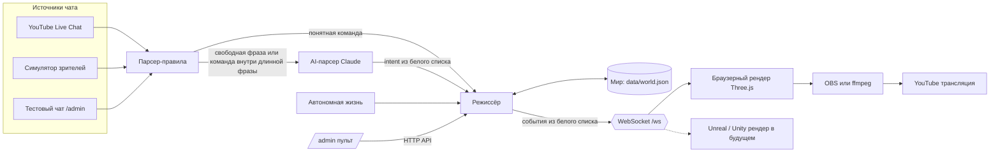

# Архитектура Live Aquarium

Документ для тех, кто будет развивать проект: как устроена система, по какому протоколу рендер получает события (чтобы подключить Unreal или Unity), как работают антиспам и AI, как перенести всё в облако.

## Схема



Главный принцип из исходного плана: **AI и чат не управляют движком напрямую.** Всё, что может произойти в аквариуме, перечислено в `server/catalog.js`:

- `INTENTS` — что может попросить чат: `feed`, `shark`, `night`, `day`, `bubbles`, `wish`, `jellyfish`, `spawn`, `myfish`.
- `ENGINE_EVENTS` — что рендер вообще способен получить: `feed`, `shark`, `night`, `day`, `bubbles`, `golden`, `jellyfish`, `fish_add`, `fish_remove`, `spotlight`.

Режиссёр (`server/director.js`) переводит первое во второе через голосования и ограничения. Рендер ничего не решает: он проигрывает события и держит аквариум живым между ними.

## Путь сообщения

1. **Источник** приводит сообщение к общему виду `{ userId, userName, text, roles: { owner, mod, member }, superchat }`.
2. **Парсер-правила** (`parser.js`) за микросекунды разбирает очевидное: слова на пяти языках, склонения («акулу»), эмодзи, опечатки (`shrak`, `sharkkk`), «!fish clownfish». Он отбрасывает приветствия («good night everyone»), отрицания («no more sharks», «не надо акулу») и счёт («day 3 of watching»).
3. **AI-парсер** (`ai-parser.js`) получает только то, что правила не поняли, и команды внутри длинных фраз («that shark was cool» — упоминание, не просьба). Подробнее ниже.
4. **Режиссёр** принимает голос или отклоняет его с причиной. Причины видны в пульте: `dup`, `user_rate`, `mode`, `already`, `user_cooldown`, `has_fish`, `no_fish`, `queue_full`, `full`.
5. Каждые 100 мс режиссёр решает, что пора запускать, и рассылает событие всем рендерам.

## Режиссёр: антиспам, пороги, приоритеты

Правила лежат в `server/catalog.js` (`RULES`). Три вида команд:

| Вид | Команды | Как работает |
|---|---|---|
| Голосование | feed, bubbles, shark, jellyfish, night, day | голоса уникальных зрителей копятся в скользящем окне; при достижении порога голосование ещё `gatherMs` открыто, чтобы одновременные голоса попали в то же событие |
| Копилка | wish | каждый уникальный зритель добавляет удачу (не чаще раза в 10 мин); копилка сохраняется между перезапусками; когда полна, приплывает золотая рыбка |
| Личная заявка | !fish, !myfish | очередь с выдачей по одной; одна рыба на зрителя; личный кулдаун начинается при выдаче, поэтому потерянная заявка никого не блокирует |

Защита от спама и перегрузки:

- **Один зритель — один голос** за окно. Повторы отклоняются (`dup`).
- **Личный лимит**: 8 голосов в минуту, всплеск до 4 (`user_rate`).
- **Порог растёт с аудиторией**: `base + floor(frac × активные)` до `max`. Для акулы это 3 + 4 % активных зрителей, но не больше 60. Порог никогда не превышает число активных зрителей, так что при двух зрителях хватает двух голосов.
- **Кулдауны** у каждого события. У дня и ночи общая группа `light`: победила ночь — голоса за день сбрасываются.
- **Глобальный бюджет**: не чаще одного события в 3,5 с и не больше 10 в минуту (в ТВ-режиме 3).
- **Приоритеты**: если в одном такте готовы несколько событий, первым идёт более важное (золотая рыбка 6 > акула 5 > медузы и свет 4 > корм 3 > рыбы 2 > пузыри 1), при равенстве — то, за которое больше голосов.
- **Состояние мира**: «ночь», когда уже ночь, отклоняется (`already`).
- **Вес голоса**: модератор ×3, спонсор ×2, Super Chat ×10 (задел для монетизации).
- **Администратор может всё.** Владелец канала в чате и кнопки пульта проходят мимо всех проверок, это первое условие в `vote()`. Сами события всё равно берутся из белого списка: это протокол, а не проверка прав.

Проверено тестом и вживую: рейд 1500 зрителей (~10 400 сообщений за 15 с) даёт одну акулу «665 viewers», 5075 повторов и 1551 превышение личного лимита.

## AI-парсер

- **Модель** по умолчанию `claude-opus-5` с `effort: low`, задаётся `AI_MODEL`. Для экономии подойдёт `claude-haiku-4-5`: для неё `effort` не отправляется.
- **Ответ ограничен JSON-схемой** (structured outputs): `intent` из списка, `species` из списка, `confidence` из `high | medium | low`. Схема передаётся с `transform: false`, иначе SDK переносит `enum` в текстовое описание и API перестаёт соблюдать белый список (это поймал тест).
- **Защита от промпт-инъекций.** Сообщения передаются как данные внутри `<chat_messages>`, а системный промпт велит классифицировать их, а не выполнять. Даже удачная инъекция даёт максимум один обычный голос, который проходит те же пороги.
- **Экономия.** Сообщения отправляются пачками до 25 штук или раз в 1,2 с. Одинаковые фразы кэшируются. Каждый зритель попадает к модели не чаще раза в 10 с (кроме владельца канала). Не больше 12 вызовов в минуту и не больше `AI_DAILY_BUDGET_USD` в день: при исчерпании бюджета работают только правила.
- **Отказы.** Для Opus 5 и Fable 5.1 включён серверный фолбэк (`fallbacks: "default"`): если классификатор безопасности отклонит пачку, API сам повторит её на рекомендованной модели. Отклонённые пачки не кэшируются.
- **Ошибки.** При 429 пауза 30 с, при сетевых ошибках экспоненциальная пауза, при неверном ключе парсер отключается, а правила продолжают работать.

## Мир и автономная жизнь

`server/world.js` хранит:

- рыб (вид, хозяин, дата рождения, seed внешности);
- время суток с перемоткой к ночи или дню;
- копилку удачи и тех, кто желал;
- рост растений, статистику, топ активных зрителей, историю событий.

Сохранение атомарное (временный файл и переименование) каждые 15 с и при остановке. Битый или незнакомый файл откладывается как `world.json.corrupt-*`, и мир начинается заново.

`server/ambient.js` поддерживает жизнь без чата. Смотритель кормит рыб, если никто не кормил 25 мин (в ТВ — 20). Раз в 6–14 мин идут пузыри. Золотая рыбка приходит сама в среднем раз в 150 мин. Ночью приплывают медузы, в среднем раз в 45 мин. Раз в минуту считается экосистема: сытые пары рождают мальков (около 2 в сутки на вид), растения растут примерно неделю.

Когда аквариум полон (140 рыб), место освобождают сначала рыбы без хозяина, затем рыбы зрителей, которые не появлялись в чате больше 7 дней.

### Последствия событий

Одни последствия — чисто визуальная реакция рыб, их рендер делает сам по событию: ажиотаж при кормлении, шар и укрытия при акуле, катание на пузырях, свита золотой рыбки. Другие меняют мир. Их решает режиссёр, чтобы все рендеры и сохранённый мир совпадали:

- **Акула съедает одну рыбу.** Жертва выбирается при запуске события по `RULES.shark.eat`. Если рыб меньше `minPopulation` (12), акула никого не трогает. Клоуны (`safe`) и рыбы младше `minAgeMs` (сутки) неприкосновенны. Рыба без хозяина выбирается с весом `ownerlessWeight` (3), рыба зрителя с весом `ownedWeight` (1). Время броска `huntAtMs` случайно в пределах `huntAfterMs` (10–18 с). Хозяин съеденной рыбы может сразу завести новую через `!fish`. Всем выжившим рыбам счётчик `survived` увеличивается на 1.
- **Золотая рыбка дарит малька** за `giftBeforeEndMs` (5 с) до ухода, если есть место. Вид случайный, в `fish_add` передаётся `gift: true`.

## 3D-модели

Рыба описывается в «пространстве рыбы»: нос в x = +0,5, длина 1, спина вверх. Процедурные рыбы строятся сразу в нём; 3D-модели приводит к нему `scripts/models/prepare.py` (Blender):

- снимает поза покоя со скелета, разворачивает модель и масштабирует;
- пишет атрибут `_AFIN`: x — часть тела (0 тело, 1 непарный плавник, 2/3 грудной), y — от основания плавника к краю (для «флага» плавников), а на теле — вес челюсти из кости рига (отрицательный на верхней губе);
- уменьшает текстуры (WebP) и экспортирует GLB без анимаций и скина.

Рендер (`renderer/js/fish/models.js`) грузит GLB до постройки аквариума и превращает каждую часть модели (по материалу) в InstancedMesh с тем же шейдером плавания, что и у процедурных рыб. Челюсть вращается вокруг `jawHinge` на угол `jawAngle × открытие × вес`. Картинки внутри GLB декодируются `createImageBitmap`, без blob:-запросов, иначе строгий CSP демо-страницы их блокирует. Хостинг артефактов не отдаёт `.glb`, поэтому в демо модели лежат как base64-текст.

## Протокол рендера

Любой рендер (браузер, Unreal, Unity) подключается по WebSocket к `ws://HOST:8787/ws?role=renderer`. Все сообщения — JSON с полем `t`.

### Сервер → рендер

`hello` приходит сразу после подключения: полное состояние, из которого строится аквариум.

```json
{"t":"hello","mode":"interactive","world":{"now":1790000000000,"tod":0.36,"todRate":5.6e-7,"growth":0.62,"luck":3,"luckTarget":20,
 "fish":[{"id":"f7","species":"clownfish","name":"Anna","bornAt":1789990000000,"seed":81234}]}}
```

`world` приходит раз в секунду и сразу после смены дня и ночи. `tod` — время суток от 0 до 1 (0 полночь, 0,25 рассвет, 0,5 полдень), `todRate` — скорость часов в долях суток за миллисекунду, между сообщениями время экстраполируется.

```json
{"t":"world","now":1790000001000,"tod":0.3601,"todRate":5.6e-7,"growth":0.62,"luck":3,"luckTarget":20,"population":42,"mode":"interactive"}
```

`event` — событие из белого списка. В `by` указано, кто вызвал: число зрителей, первые имена, признаки `admin` и `system`.

```json
{"t":"event","id":17,"kind":"shark","params":{"durationMs":55000,"side":"left","victim":{"id":"f12","species":"tang","name":"Max"},"huntAtMs":13400},
 "by":{"count":327,"names":["Anna","Max","Leo"],"voice":327,"admin":false,"system":false},"at":1790000002000}
```

| kind | params | что показать |
|---|---|---|
| `feed` | `amount`, `x`, `durationMs` | насыпать `amount` хлопьев около `x`; весь аквариум ~16 с рвётся к месту падения, рыбы-домоседы выплывают из укрытия частично |
| `bubbles` | `intensity`, `durationMs` | завеса пузырей; игривые виды (хромисы, тэнги) катаются на ней вверх |
| `shark` | `durationMs`, `side`, `victim`, `huntAtMs` | акула заплывает с `side` и патрулирует; за 4 с до `huntAtMs` подкрадывается к `victim` (`{id, species, name}` или `null`), в `huntAtMs` бросается с открытой пастью и съедает её, а примерно через 10 с после укуса уплывает. Остальные сбиваются в шар и прячутся |
| `jellyfish` | `count`, `durationMs` | медузы; рыбы, кроме клоунов, их обходят |
| `golden` | `durationMs` | золотая рыбка проплывает перед камерой, хромисы и тэнги её сопровождают |
| `night` / `day` | `target`, `transitionMs` | звуковой акцент; само время придёт в `world`. Утром — всплеск активности |
| `fish_add` | `fish`, `born`, `gift` | новая рыба: вплывает сбоку, либо малёк появляется у родителя; `gift` — подарок золотой рыбки (блёстки). Новичка встречают трое сородичей |
| `fish_remove` | `fishId`, `reason` | рыба уплывает за край кадра |
| `spotlight` | `fishId`, `name`, `species`, `durationMs`, `survived` | рыба подплывает к стеклу и позирует, над ней подпись; `survived` — сколько акул она пережила |

Жертва акулы к моменту события уже удалена из мира, и в следующем `hello` её не будет. Рендер держит её до укуса. Если акула почему-то уплыла без охоты, жертва уплывает за край кадра вместе с ней.

`meters` приходит дважды в секунду, для оверлея: прогресс голосований и кулдауны.

```json
{"t":"meters","mode":"interactive","active":120,"population":42,"meters":[
 {"intent":"shark","kind":"vote","enabled":true,"cooldownMs":0,"count":12,"voice":14,"need":7,"blocked":null}]}
```

`mode` сообщает о переключении режима в пульте: `{"t":"mode","mode":"tv"}`.

### Рендер → сервер

Раз в 2 с рендер шлёт пульс: сколько кадров нарисовано за сколько миллисекунд. По нему работают пульт и `/healthz`.

```json
{"t":"hb","frames":120,"ms":2001,"fish":42,"size":"1920x1080","quality":"high"}
```

В `hello` и `fish_add` не передаётся `ownerId` (id YouTube-канала владельца): рендеру нужно только имя.

### Как подключить Unreal Engine

1. Актор-менеджер с модулем `WebSockets` подключается к `/ws?role=renderer`.
2. По `hello` создаются рыбы из `world.fish`. Вид берётся из `species`, внешность можно детерминированно варьировать по `seed`, размер вычисляется из возраста (`bornAt`).
3. `event` превращается в Blueprint-события `OnFeed`, `OnShark` и так далее, `world.tod` — в параметр освещения (Sky/Directional Light, туман, цвет воды).
4. Каждые 2 с отправляется `hb` с FPS.

Режиссёр, чат, AI, антиспам и сохранение мира не меняются. Браузерный и Unreal-рендер могут работать одновременно: например, браузер как превью в пульте, а Unreal в эфире. Для Unity то же самое через любой WebSocket-клиент (например, NativeWebSocket).

## HTTP API

Если задан `ADMIN_TOKEN`, запросы к `/api/*` требуют заголовок `x-admin-token` или параметр `?token=`. Без токена администраторские запросы принимаются только с loopback-адреса (или имени из `ALLOWED_HOSTS`). Запросы с чужим `Origin` отклоняются в обоих случаях, а POST обязан приходить с `Content-Type: application/json`: так браузер не пропустит запрос с чужого сайта без preflight. Админский WebSocket без прав отклоняется ещё до апгрейда.

| Метод | Путь | Что делает |
|---|---|---|
| GET | `/healthz` | 200, если хотя бы один доверенный рендер (при `ADMIN_TOKEN` — подключённый с токеном) действительно рисует ≥ 15 кадров в секунду, иначе 503. FPS считается по кадрам, нарисованным между пульсами, так что зависший рендер даёт 0. Для сторожа, который перезапускает браузер |
| GET | `/api/status` | всё состояние для пульта |
| POST | `/api/chat` `{user, text}` | сообщение от имени обычного зрителя, со всеми ограничениями |
| POST | `/api/admin/trigger` `{kind, species?}` | событие от администратора, без ограничений |
| POST | `/api/admin/mode` `{mode}` | `interactive` или `tv` |
| POST | `/api/admin/sim` `{action, scenario, viewers, intent, durationMs}` | симулятор: `start`, `stop`, `raid` |
| POST | `/api/admin/youtube` `{action, videoId}` | подключить или остановить чат трансляции |
| POST | `/api/admin/fish/remove` `{fishId}` | убрать рыбу, например с неприличным именем |

## YouTube: квота и задержка

- `liveChatMessages.list` стоит 1 единицу. Квота по умолчанию — 10 000 единиц в сутки, обнуляется в полночь по тихоокеанскому времени.
- Опрос не чаще, чем просит YouTube (`pollingIntervalMillis`). Сверх этого остаток квоты распределяется на время до обнуления: круглосуточно это примерно раз в 9 с. `YOUTUBE_MIN_POLL_MS` задаёт интервал явно, для коротких тестовых эфиров.
- При подключении первая страница (история чата) пропускается.
- Ошибки: `quotaExceeded` — ждать обнуления; `liveChatEnded` — искать новый эфир раз в минуту; 401 при OAuth — обновить токен; сетевые ошибки — экспоненциальная пауза до 60 с.
- **Для 24/7** есть два пути: запросить у Google увеличение квоты (форма YouTube API Services) или перейти на `liveChatMessages.streamList` — серверный поток сообщений с меньшей задержкой. Его протокол нужно проверить на живом ключе перед внедрением.
- Задержку «сообщение опубликовано → получено сервером» показывает пульт (`задержка чата`).

## Облако (этап 4)

Цель — чтобы эфир не зависел от домашнего компьютера, интернета и электричества.

**Минимальная конфигурация: одна облачная машина с видеокартой NVIDIA.**

- Режиссёр: `node server/index.js` как сервис systemd с `Restart=always`.
- Рендер: сейчас это Chromium с аппаратным WebGL, в будущем Unreal в режиме offscreen.
- Кодировщик: OBS (Browser Source) или ffmpeg с NVENC, поток RTMPS в YouTube.
- Сторож: раз в 10–15 с опрашивает `/healthz`. Нет пульса или FPS < 15 — перезапускает рендер. Упал поток — перезапускает кодировщик и шлёт алерт (например, в Telegram).
- Состояние мира в `data/` на постоянном диске, плюс ежедневный бэкап `world.json`.

**Схема из исходного плана (две машины)** надёжнее: режиссёр на дешёвой CPU-машине, рендер и кодировщик на GPU-машине. Если GPU-машина перезапустится, мир, чат и голосования продолжат жить, а рендер подключится заново и получит `hello`.

**Что проверить при выборе провайдера** (AWS g5/g6, Google Cloud G2, Azure NV, специализированные GPU-хостинги):

1. Есть ли NVENC у видеокарты. Кодирование на CPU съест машину.
2. Помесячная цена за 24/7: резерв или выделенный сервер обычно заметно дешевле почасовой оплаты.
3. Исходящий трафик: круглосуточный поток — это сотни гигабайт в месяц, у части облаков он платный.
4. Поддержка headless-рендера без монитора: EGL для Chromium, `-RenderOffscreen` для Unreal.
5. Стабильность RTMP до серверов YouTube из выбранного региона.

Для браузерного рендера на Linux нужен Chromium с аппаратным GPU. Программный рендер (SwiftShader) не потянет 1080p60. Команды запуска и захвата для конкретного провайдера нужно отладить на месте: этот этап в прототипе не выполнялся.

## Shorts

`data/highlights.jsonl` пишет момент каждого яркого события с готовым заголовком:

```json
{"at":"2026-09-29T12:16:17.100Z","kind":"shark","viewers":665,"title":"665 Viewers Summoned a Shark Into the Aquarium"}
```

Следующий шаг — скрипт, который берёт запись эфира (OBS или VOD), вырезает `[t − 10 с, t + 25 с]` вокруг момента, делает вертикальный кроп 9:16, добавляет подпись и загружает через YouTube API (`videos.insert` — отдельная квота, по умолчанию 100 загрузок в сутки).

## Дорожная карта по этапам исходного плана

| Этап | Что есть в прототипе | Что дальше |
|---|---|---|
| 1. Технический прототип сцены | стилизованный риф, 6 видов рыб, кормление, хищник, день и ночь, звук | решить Unreal или Unity; купить или заказать модели рыб; поставить целевой уровень реализма |
| 2. Интерактивность | 9 команд, 5 языков, AI-парсер, антиспам, симулятор, YouTube-коннектор | проверить на живом эфире с ключом; замерить задержку «сообщение → событие» |
| 3. ASMR и ТВ | ТВ-режим, статичные планы, процедурный звук | записанные звуки воды, саунд-дизайн, проверка на большом телевизоре |
| 4. Облако | `/healthz`, пульс рендера, сохранение мира, план выше | выбрать провайдера, собрать образ, настроить сторожа и алерты |
| 5. Тестовые эфиры по 2–4 часа | можно начинать с этим прототипом | смотреть удержание и активность чата, выбрать удачные события |
| 6. Полноценный запуск | — | новые миры (Амазонка, медузарий, ночной аквариум) на том же режиссёре |
